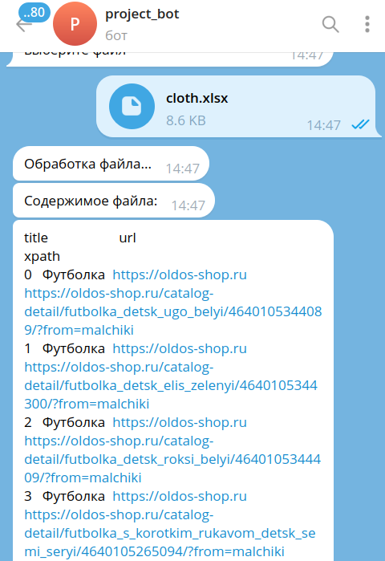
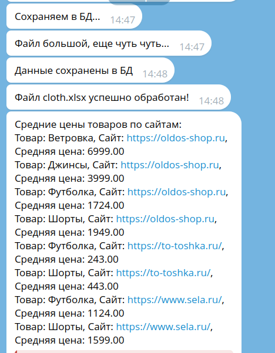

# Telegram Bot для парсинга цен

Этот проект представляет собой Telegram-бота, который позволяет пользователям загружать Excel-файлы с информацией о сайтах для парсинга цен товаров. Бот обрабатывает загруженные файлы, сохраняет данные в базу данных и может выполнять парсинг цен с указанных сайтов.

## Функциональность
- Загрузка Excel-файлов с информацией о сайтах для парсинга
- Обработка файлов с помощью pandas
- Сохранение данных в базу данных PostgreSQL (asyncpg)
- Бот может проводить парсинг по данным из таблицы и выводить среднюю цену товара по каждому сайту.
- Расчет средней цены товара по каждому сайту

## Технологии
- Python 3.10+
- aiogram - фреймворк для создания Telegram-ботов
- pandas - для работы с табличными данными
- asyncpg - асинхронный драйвер PostgreSQL
- beautifulsoup4 - для парсинга HTML
- aiohttp - для асинхронных HTTP-запросов
- python-dotenv - для работы с переменными окружения

## Установка и запуск

### Предварительные требования
- Python 3.10 или выше
- PostgreSQL
- Токен Telegram бота (получить у @BotFather)


### Установка
- Клонируйте репозиторий:
```bash
git clone https://github.com/rusov63/Parsing_TGbot.git
cd Parsing_TGbot
```
- Создайте и активируйте виртуальное окружение:
```bash
python -m venv venv
source venv/bin/activate  **для Linux/Mac**
venv\Scripts\activate     **для Windows**
```
- Установите зависимости:
```bash
pip install -r requirements.txt
```
Переименуйте файл `env.sample` в `.env` в корне проекта для добавление переменных окружения (смотрите файл в директории):
```
BOT_TOKEN=
PG_LINK=
ADMIN_ID=укажите свой id TG
```
- Создайте базу данных PostgreSQL:
```bash
createdb postgres_database
```

### Запуск

```bash
python run.py
```

## Структура проекта
```
├── app
│   ├── bd
│   ├── calc_average_price.py
│   ├── correct_data.py
│   ├── handler_main.py
│   ├── __init__.py
│   ├── keyboards
│   ├── other
│   ├── prices_parser.py
│   └── test
├── bot_start.py
├── cloth.xlsx
├── config.py
├── downloads
├── env.sample
├── readme.md
├── requirements.txt
├── run.py
```

## Использование
- Найдите бота в Telegram по его имени пользователя
- Нажмите кнопку "Загрузить файл"
- Загрузите Excel-файл
- Бот обработает файл и выведет его содержимое
- Для парсинга цен и расчета средней цены используйте соответствующую команду

## Формат Excel-файла

Excel-файл должен содержать следующие столбцы:
- title - название товара
- url - ссылка на сайт с товаром
- xpath - путь к элементу с ценой

## Контакты
Если у вас есть вопросы или предложения, пожалуйста, свяжитесь со мной по адресу: [rusov63@yahoo.com]



